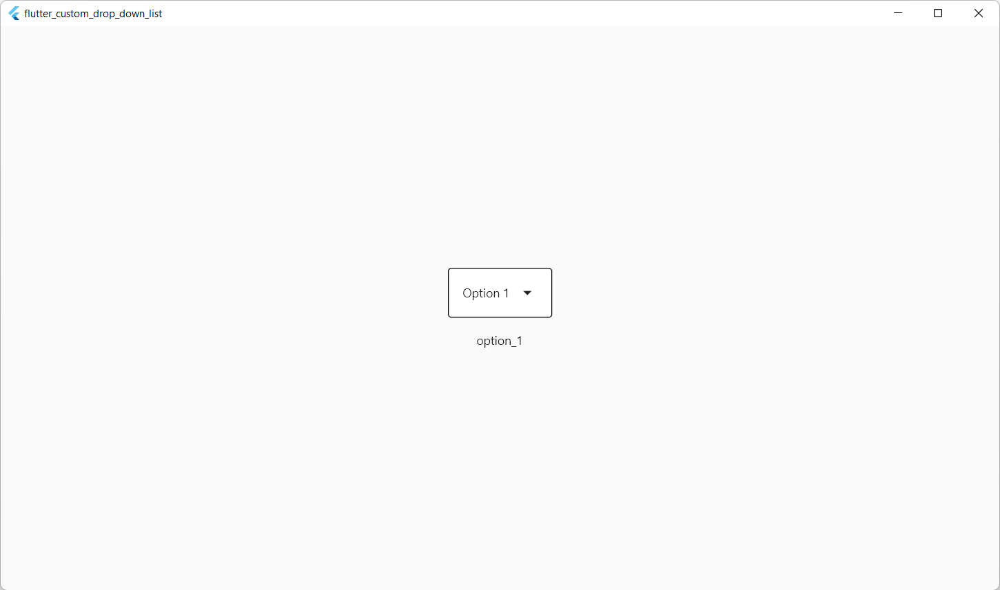
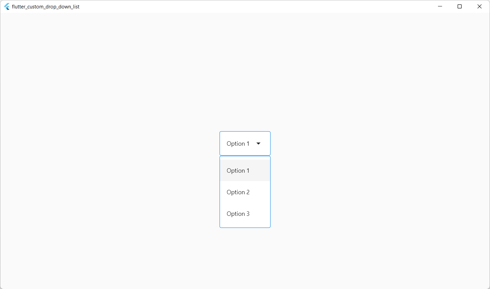

# Flutter Custom Drop-Down List

This is a demo application for the “[Flutter Custom Drop-Down List](https://medium.com/@dmitrysikorsky/custom-drop-down-list-flutter-widget-with-focus-and-keyboard-support-681c1015113f)” post on the Dmitry Sikorsky’s blog. It demonstrates how to build a simple drop-down list that supports focus and keyboard in Flutter 3.

## Sample Screenshots

*Normal state*

*Expanded state*

## Links

Author: http://sikorsky.pro/
